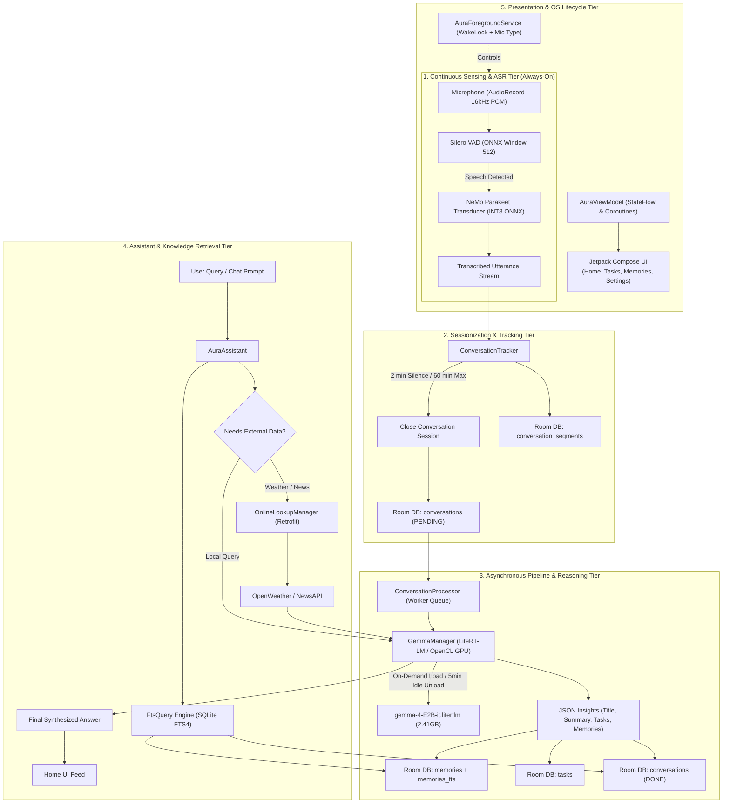
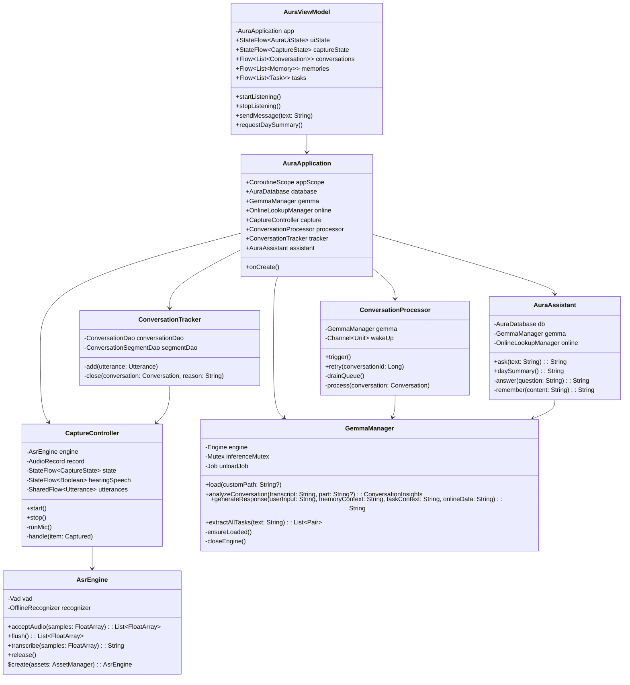
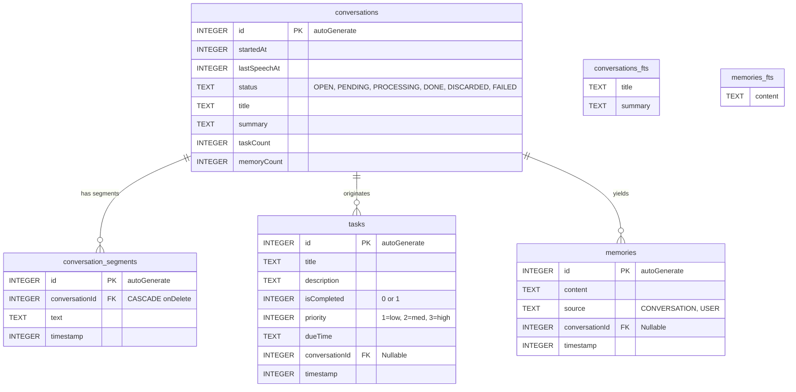
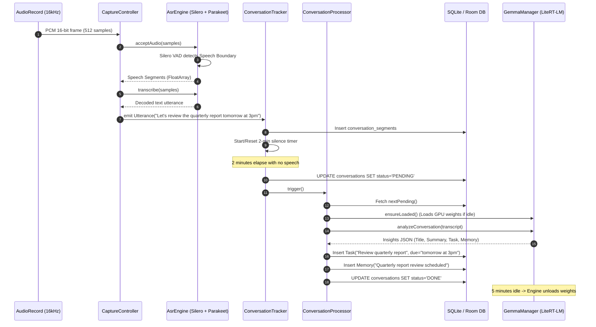
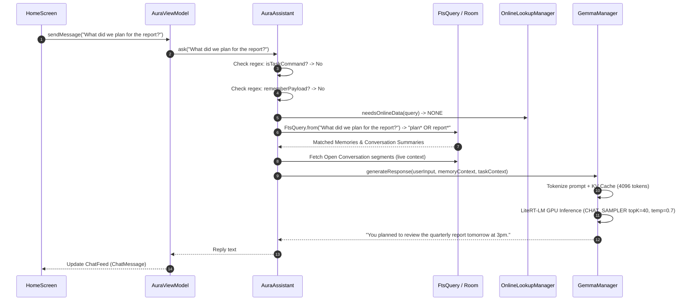

# AURA (Autonomous Unified Reasoning Assistant)
## Complete High-Level Design (HLD), Low-Level Design (LLD) & File-by-File Codebase Analysis

---

## 1. Executive Summary

**AURA (Autonomous Unified Reasoning Assistant)** is an edge-native, privacy-preserving, always-on personal companion application built for Android. It is engineered to fulfill the 2026 hackathon mandate:
* **100% On-Device Reasoning & Sensing**: Audio capture, voice activity detection, automatic speech recognition (ASR), conversational sessionization, semantic extraction, memory generation, task creation, and generative question answering execute strictly on the local hardware (ARM64 CPU / Adreno/Mali GPU).
* **Strict Privacy Air-Gap**: No spoken audio, transcripts, raw memories, or private conversations ever leave the physical boundary of the mobile device.
* **Controlled Factual Online Boundary**: Network calls are strictly restricted to stateless, real-time external lookups (e.g. OpenWeatherMap for live meteorological conditions, NewsAPI for live headlines). Online data is ingested only as supplementary context; reasoning over that data is performed locally by Gemma. Every network request is audited and exposed to the user via a live transparency dashboard.
* **Battery & Compute Co-Design**: Replaces battery-intensive Android `SpeechRecognizer` and heavy persistent models with a decoupled two-tier architecture:
  1. *Tier 1 (Sub-milliwatt Standby)*: Continuous 16 kHz audio streaming through an INT8-quantized **Silero VAD** and streaming **NVIDIA NeMo Parakeet 110M Transducer** via **Sherpa-ONNX**, consuming negligible CPU with zero system chime sounds.
  2. *Tier 2 (On-Demand Acceleration)*: **Google Gemma 4 E2B** executed via **LiteRT-LM** with native OpenCL GPU acceleration (and automatic CPU fallback). Gemma is loaded on demand when a conversation concludes or a query is submitted, and automatically unloads its 2.3 GB memory footprint after 5 minutes of idle time.

---

## 2. High-Level Design (HLD)

### 2.1 System Architecture Diagram

### 2.2 Core Architectural Subsystems

1. **Continuous Capture Subsystem (`capture/`)**:
   - Manages an uncompressed, low-latency mono audio stream using standard Android `AudioRecord` configured at 16,000 Hz, 16-bit PCM.
   - Pushes 512-sample frames into an embedded **Silero VAD** ONNX model.
   - When speech begins, accumulates PCM audio buffers; upon utterance boundary detection (0.8s silence), dispatches audio into the **NVIDIA NeMo Parakeet TDT Transducer** (`encoder.int8.onnx`, `decoder.int8.onnx`, `joiner.int8.onnx`).
   - Dispatches transcribed `Utterance(text, startedAt, endedAt)` structs without disk I/O.

2. **Conversational Sessionizer & Segmenter (`pipeline/ConversationTracker.kt`)**:
   - Converts an infinite linear stream of utterances into discrete, contextual conversations.
   - Employs a stateful sliding-window temporal heuristic:
     - **Inter-utterance Gap (`GAP_MS = 120,000 ms`)**: Two continuous minutes of ambient silence terminates the current session.
     - **Session Cap (`MAX_DURATION_MS = 3,600,000 ms`)**: Prevents perpetual conversation sprawl (e.g. ambient television or radio) by forcibly sealing and segmenting after 60 minutes.
     - **State Re-queueing**: Interrupted conversations (e.g. process death or device reboot) are flagged and automatically picked up upon restart.

3. **Background Cognitive Processor (`pipeline/ConversationProcessor.kt`)**:
   - Asynchronous single-worker queue driven by a conflated Kotlin coroutine channel.
   - Evaluates conversation length against noise threshold (`MIN_WORDS = 8`); noisy or meaningless remarks are discarded without invoking LLM inference.
   - Splits long transcripts into bounded chunks (`MAX_TRANSCRIPT_CHARS = 8000`, ~2,000 tokens) respecting utterance boundaries.
   - Invokes on-device Gemma to generate structured JSON insights: semantic conversation title, abstractive summary, actionable tasks with deadlines, and durable personal memories.
   - Inserts records atomically into Room tables with SQLite FTS4 virtual tables.

4. **Hybrid Retrieval & Reasoning Assistant (`ai/AuraAssistant.kt`)**:
   - Handles multi-turn conversational chat, question answering, day summaries, and explicit memory commands ("remember that...", "remind me to...").
   - Implements a hybrid context assembler:
     - Full-Text Search (FTS4) matching against user memories and past conversation summaries.
     - Recent temporal window retrieval (latest conversations and today's active transcript).
     - Deterministic rule-based filter (`OnlineLookupManager`) to identify external queries (e.g. weather, news).
   - Prompts local Gemma with structured contextual blocks (`SYSTEM_PROMPT`, `MEMORIES`, `CONVERSATIONS`, `ACTIVE_TRANSCRIPT`, `ONLINE_DATA`).

5. **Resource & Lifecycle Engine (`service/AuraForegroundService.kt` & `ai/GemmaManager.kt`)**:
   - `AuraForegroundService` binds to the Android OS with foreground type `FOREGROUND_SERVICE_TYPE_MICROPHONE`. Holds an acquire/release partial `WakeLock` to prevent CPU sleep while screen is locked.
   - `GemmaManager` dynamically loads the 2.4 GB `.litertlm` binary into OpenCL GPU runtime buffers only when inference is needed, and terminates the engine after 5 minutes of idle time via an auto-cancelling coroutine timer.

---

## 3. Low-Level Design (LLD)

### 3.1 Class & Component Relationship Diagram

### 3.2 Database Schema & ER Model

#### Database Design Specifics:
1. **FTS4 Content Virtual Tables**: `conversations_fts` and `memories_fts` are linked via `contentEntity` to their respective source tables. Room automatically creates SQLite database triggers (`*_bu`, `*_bd`, `*_au`, `*_ai`) to maintain index synchronization without manual query overhead.
2. **Cascading Segments**: Foreign key cascade on `conversation_segments.conversationId` ensures that purging a conversation immediately cleans up all associated transcribed audio segments.
3. **Destructive Migration Strategy**: Built with `.fallbackToDestructiveMigration(dropAllTables = true)` for fast, reliable hackathon iteration.

---

### 3.3 Sequence Diagrams

#### Sequence 1: Always-On Speech Capture & Offline Processing

#### Sequence 2: User Chat Query & Retrieval Pipeline

---

## 4. File-by-File Detailed Analysis

Below is the complete line-by-line and architectural breakdown of every file across the codebase.

---

### 4.1 Application Root & Gradle Configurations

#### 1. [`build.gradle.kts`](file:///D:/Project/makeathon21/build.gradle.kts)
* **File Path**: `D:\Project\makeathon21\build.gradle.kts`
* **Purpose**: Top-level root project build configuration.
* **Key Code Components**:
  * Configures top-level Gradle plugins via alias syntax:
    * `libs.plugins.android.application` (AGP 8.13.2)
    * `libs.plugins.kotlin.android` (Kotlin 2.3.21)
    * `libs.plugins.kotlin.compose` (Compose Compiler plugin)
    * `libs.plugins.ksp` (Kotlin Symbol Processing `2.3.12`)
* **Architectural Rationale**: Root configuration applies plugins with `apply false`, allowing the subproject `:app` to consume identical version-controlled toolchains.

#### 2. [`app/build.gradle.kts`](file:///D:/Project/makeathon21/app/build.gradle.kts)
* **File Path**: `D:\Project\makeathon21\app\build.gradle.kts`
* **Purpose**: Module-level build script defining dependencies, native ABI packaging, compilation options, and automated offline ASR model downloading.
* **Key Sections & Logic**:
  * **Lines 12–27 (`android` block)**: Sets `compileSdk = 35`, `minSdk = 29` (Android 10), and `targetSdk = 35`. Explicitly restricts NDK ABIs to `arm64-v8a` and `x86_64` (LiteRT-LM native binaries do not ship for 32-bit `armeabi-v7a`).
  * **Lines 29–40 (`local.properties` loader)**: Programmatically parses `local.properties` at build time to populate `BuildConfig.WEATHER_API_KEY` and `BuildConfig.DEFAULT_CITY` ("Mumbai") without hardcoding secrets in Git.
  * **Lines 53–56 (`compileOptions`)**: Targets Java 17 compatibility.
  * **Lines 63–67 (`androidResources`)**: Configures `noCompress += listOf("litertlm", "onnx")`. This is critical: prevents Android AAPT from compressing the large model assets, enabling Sherpa-ONNX and LiteRT to memory-map (`mmap`) model files directly from the APK or asset storage.
  * **Lines 69–137 (`fetchSpeechModels` task)**: Automated model provisioner running at configuration time:
    * Downloads `sherpa-onnx-1.13.8.aar` from GitHub releases with SHA-256 verification (`633c24321e06b1fe79feafa03ea16cbc0f8a286641e2da3559bac91bdb13bd96`).
    * Downloads `silero_vad.onnx` (`9e2449e1087496d8d4caba907f23e0bd3f78d91fa552479bb9c23ac09cbb1fd6`).
    * Downloads and extracts NVIDIA Parakeet TDT 110M INT8 transducer (`encoder.int8.onnx`, `decoder.int8.onnx`, `joiner.int8.onnx`, `tokens.txt`) (~135 MB).
  * **Lines 149–182 (`dependencies`)**: Declares dependencies:
    * Compose BOM & Material 3
    * AndroidX Navigation & ViewModel Compose
    * AndroidX Room 2.8.5 with KSP compiler
    * Retrofit 2.11.0 + Gson converter + OkHttp logging
    * Google LiteRT-LM (`com.google.ai.edge.litertlm:litertlm-android:0.17.1`)
    * Local Sherpa-ONNX file tree dependency (`libs/sherpa-onnx-1.13.8.aar`).

#### 3. [`gradle/libs.versions.toml`](file:///D:/Project/makeathon21/gradle/libs.versions.toml)
* **File Path**: `D:\Project\makeathon21\gradle\libs.versions.toml`
* **Purpose**: Centralized Gradle version catalog.
* **Key Dependencies Declared**:
  * `agp = "8.13.2"`, `kotlin = "2.3.21"`, `ksp = "2.3.12"`, `room = "2.8.5"`
  * `litertlm-android = "0.17.1"` (Google LiteRT runtime for on-device Gemma models).

#### 4. [`app/src/main/AndroidManifest.xml`](file:///D:/Project/makeathon21/app/src/main/AndroidManifest.xml)
* **File Path**: `D:\Project\makeathon21\app\src\main\AndroidManifest.xml`
* **Purpose**: System declaration file for permissions, native GPU runtime linkages, and application components.
* **Key Elements**:
  * **Permissions**:
    * `RECORD_AUDIO`: Required for continuous microphone ingestion.
    * `FOREGROUND_SERVICE` and `FOREGROUND_SERVICE_MICROPHONE`: Enforces Android 14+ background execution policies for microphone access.
    * `WAKE_LOCK`: Keeps CPU active while screen is turned off.
    * `MANAGE_EXTERNAL_STORAGE`: Allows reading the ~2.4GB Gemma model placed in `/sdcard/Download/`.
    * `INTERNET` and `ACCESS_NETWORK_STATE`: Required strictly for `OnlineLookupManager` (weather & news APIs).
  * **Native Libraries (`<uses-native-library>`)**:
    * `libvndksupport.so`, `libOpenCL.so`, `libOpenCL-car.so`, `libOpenCL-pixel.so` with `android:required="false"`. These declarations allow LiteRT-LM to bind to vendor OpenCL drivers on Adreno/Mali GPUs without failing app installation on devices without OpenCL.
  * **Service**: Registers `AuraForegroundService` with `android:foregroundServiceType="microphone"`.

---

### 4.2 Application Core & Lifecycle

#### 5. [`AuraApplication.kt`](file:///D:/Project/makeathon21/app/src/main/java/com/aura/companion/AuraApplication.kt)
* **File Path**: `D:\Project\makeathon21\app\src\main\java/com/aura/companion/AuraApplication.kt`
* **Purpose**: Base `Application` class acting as the dependency injection container and root scope provider.
* **Key Components**:
  * `appScope`: Root coroutine scope bound to `SupervisorJob() + Dispatchers.Default`. Outlives any UI Activity or screen, ensuring background capture and model inference continue unimpeded.
  * Lazy Singletons:
    * `database`: Thread-safe Room database instance.
    * `gemma`: Shared `GemmaManager` initialized with `appScope`.
    * `online`: `OnlineLookupManager` instance.
    * `capture`: `CaptureController` managing the microphone.
    * `processor`: `ConversationProcessor` processing batch conversational chunks.
    * `tracker`: `ConversationTracker` wired directly to `processor::trigger`.
    * `assistant`: High-level conversational assistant.
  * `instance`: Static companion accessor providing global application context.

#### 6. [`MainActivity.kt`](file:///D:/Project/makeathon21/app/src/main/java/com/aura/companion/MainActivity.kt)
* **File Path**: `D:\Project\makeathon21\app\src\main\java/com/aura/companion/MainActivity.kt`
* **Purpose**: Primary Android entry activity with edge-to-edge Compose rendering and storage permission workflows.
* **Key Components**:
  * `onCreate()`: Configures edge-to-edge UI with `enableEdgeToEdge()`.
  * `requestModelFileAccess()`: On Android 11+ (API 30+), verifies `Environment.isExternalStorageManager()`. If not granted, launches an intent to `Settings.ACTION_MANAGE_APP_ALL_FILES_ACCESS_PERMISSION` so the app can load `.litertlm` models from the phone's Download directory.
  * Automatic Session Resume: Checks `AuraForegroundService.wasListening(this)` and auto-restarts listening if the user left capture active in a previous session.
  * Renders `AuraNavHost()` inside `AuraTheme`.

#### 7. [`service/AuraForegroundService.kt`](file:///D:/Project/makeathon21/app/src/main/java/com/aura/companion/service/AuraForegroundService.kt)
* **File Path**: `D:\Project\makeathon21\app\src\main\java/com/aura/companion/service/AuraForegroundService.kt`
* **Purpose**: Dedicated Android Foreground Service managing microphone capture lifecycle, notification status, and CPU power management.
* **Key Components**:
  * `CHANNEL_ID = "aura_listening_channel"`: Low-importance, persistent, silent notification channel.
  * `updateWakeLock(hold: Boolean)`: Acquires/releases a `PowerManager.PARTIAL_WAKE_LOCK` tagged `"Aura::Capture"`. This guarantees the CPU remains active to process audio and run VAD even when the user locks their screen or puts the device in their pocket.
  * Reactive Notification Updater: Combines `capture.state` and `processor.busy` flows to reflect live status:
    * *"Listening"* (audio stream active)
    * *"Summarizing a conversation on this phone…"* (local LLM running)
    * Includes an inline "Stop" action button to instantly halt capture.
  * `ServiceCompat.startForeground`: Starts with `FOREGROUND_SERVICE_TYPE_MICROPHONE`.

---

### 4.3 On-Device Audio Sensing & Capture Engine

#### 8. [`capture/AsrEngine.kt`](file:///D:/Project/makeathon21/app/src/main/java/com/aura/companion/capture/AsrEngine.kt)
* **File Path**: `D:\Project\makeathon21\app\src\main\java/com/aura/companion/capture/AsrEngine.kt`
* **Purpose**: Low-level JNI/C++ wrapper bridging to Sherpa-ONNX for local Voice Activity Detection and Transducer speech recognition.
* **Key Components & Algorithms**:
  * Constants: `SAMPLE_RATE = 16_000 Hz`, `VAD_WINDOW = 512` samples.
  * `create(assets: AssetManager)`: Factory method configuring:
    * `VadModelConfig`: Loads `asr/silero_vad.onnx`, threshold `0.5`, `minSilenceDuration = 0.8s` (pause duration separating utterances), `minSpeechDuration = 0.25s`, `maxSpeechDuration = 20s`.
    * `OfflineRecognizerConfig`: Transducer architecture with `encoder.int8.onnx`, `decoder.int8.onnx`, `joiner.int8.onnx`, using `greedy_search` decoding on 2 threads.
  * `acceptAudio(samples: FloatArray)`: Ingests 512-sample float PCM chunks into the Silero VAD. When a speech segment is completed, returns the audio segment for transcription.
  * `transcribe(samples: FloatArray)`: Passes PCM waveform into the offline recognizer stream, runs `decode()`, and returns capitalized, punctuated text.
  * `flush()`: Drains any in-progress speech segments when the microphone stops.

#### 9. [`capture/CaptureController.kt`](file:///D:/Project/makeathon21/app/src/main/java/com/aura/companion/capture/CaptureController.kt)
* **File Path**: `D:\Project\makeathon21\app\src\main\java/com/aura/companion/capture/CaptureController.kt`
* **Purpose**: High-level microphone controller orchestrating hardware capture, thread handoffs, and utterance emissions.
* **Key Components**:
  * `CaptureState`: State machine (`STOPPED`, `STARTING`, `LISTENING`, `ERROR`).
  * `utterances`: `SharedFlow<Utterance>` emitting transcribed sentences with `startedAt` and `endedAt` timestamps.
  * `runMic()`: Executes on `Dispatchers.IO`:
    * Initializes `AudioRecord` with `MediaRecorder.AudioSource.VOICE_RECOGNITION`, 16 kHz mono, 16-bit PCM.
    * Continuously reads buffers of 512 shorts, normalizes to floats (`buffer[it] / 32768f`), and submits to `AsrEngine.acceptAudio()`.
    * Offloads captured audio segments into an unbuffered Kotlin coroutine `Channel<Captured>` so that transcription on `Dispatchers.Default` never stalls the real-time audio read loop.
  * Safe cleanup: Properly releases hardware audio records and flushes trailing speech when stopped.

---

### 4.4 Conversational Pipeline & Sessionization

#### 10. [`pipeline/ConversationTracker.kt`](file:///D:/Project/makeathon21/app/src/main/java/com/aura/companion/pipeline/ConversationTracker.kt)
* **File Path**: `D:\Project\makeathon21\app\src\main\java/com/aura/companion/pipeline/ConversationTracker.kt`
* **Purpose**: Temporal conversation boundary detector converting discrete utterances into logical conversation sessions.
* **Key Components**:
  * `GAP_MS = 120_000L` (2 minutes): Silence window that demarcates the end of a conversation.
  * `MAX_DURATION_MS = 3_600_000L` (60 minutes): Safety cap preventing unbounded session duration.
  * `add(utterance: Utterance)`:
    * Checks existing open conversation via `conversationDao.getOpen()`.
    * If silence gap exceeded, marks open conversation as `PENDING` and spawns a new `Conversation` entity.
    * Persists `ConversationSegment` linked to `conversationId`.
    * Cancels and resets the 2-minute gap watchdog timer (`gapJob`).
  * `closeOpen(reason: String)`: Transitions conversation status to `PENDING` and triggers `onClosed()` callback.
  * Crash Recovery: At initialization, queries `requeueInterrupted()` to mark any lingering `OPEN` or `PROCESSING` sessions as `PENDING` so no data is lost after a crash.

#### 11. [`pipeline/ConversationProcessor.kt`](file:///D:/Project/makeathon21/app/src/main/java/com/aura/companion/pipeline/ConversationProcessor.kt)
* **File Path**: `D:\Project\makeathon21\app\src\main\java/com/aura/companion/pipeline/ConversationProcessor.kt`
* **Purpose**: Asynchronous worker pipeline that translates raw conversation transcripts into structured summaries, memories, and tasks.
* **Key Components**:
  * Conflated Signal Channel: `wakeUp = Channel<Unit>(Channel.CONFLATED)` prevents redundant concurrent queue processing.
  * Noise Filtering: Computes total words across segments. If `wordCount < MIN_WORDS` (8 words), flags conversation as `DISCARDED` and aborts LLM inference to preserve power.
  * Transcript Chunking: Breaks lengthy conversations into chunks under `GemmaManager.MAX_TRANSCRIPT_CHARS` (8000 characters) while preserving utterance line boundaries.
  * Multi-Chunk Synthesis: Invokes `gemma.analyzeConversation()` for each chunk. If multiple chunks exist, merges their summaries via `gemma.mergeSummaries()`.
  * Atomic DB Updates:
    * Inserts new `Task` records (deduplicated by title).
    * Inserts new `Memory` records (source `MemorySource.CONVERSATION`).
    * Updates `Conversation` status to `DONE` with title, summary, task count, and memory count.

---

### 4.5 AI Reasoning Engine & Online Boundary

#### 12. [`ai/GemmaManager.kt`](file:///D:/Project/makeathon21/app/src/main/java/com/aura/companion/ai/GemmaManager.kt)
* **File Path**: `D:\Project\makeathon21\app\src\main\java/com/aura/companion/ai/GemmaManager.kt`
* **Purpose**: Central on-device inference manager executing Google Gemma 4 E2B via Google LiteRT-LM.
* **Key Components & Parameters**:
  * Model Specifications:
    * Target file: `gemma-4-E2B-it.litertlm` (~2.41 GB quantized instruction-tuned model).
    * `MAX_NUM_TOKENS = 4096`: KV-cache size comfortably balancing memory on 8 GB devices with conversational depth.
    * Sampler Configurations:
      * `CHAT_SAMPLER`: `topK = 40`, `topP = 0.95`, `temperature = 0.7` for natural conversational variety.
      * `PRECISE_SAMPLER`: `topK = 1`, `topP = 1.0`, `temperature = 1.0` for deterministic JSON/task extraction.
  * On-Demand Lifecycle & Memory Optimization:
    * `IDLE_UNLOAD_MS = 300_000L` (5 minutes).
    * `ensureLoaded()`: Lazily initializes the native `Engine` only when an inference call is made.
    * `scheduleIdleUnload()`: Resets a 5-minute coroutine countdown after every inference job. When expired, calls `closeEngine()` to release GPU VRAM and system memory back to Android.
  * Hardware Acceleration:
    * Attempts initialization with `Backend.GPU()` (OpenCL).
    * Catches driver failures or unsupported device exceptions and seamlessly falls back to `Backend.CPU()`. Updates `activeBackend` StateFlow to inform the UI.
  * Core Prompts & Inference APIs:
    * `analyzeConversation(transcript, part)`: Prompts Gemma to return strict JSON containing `title`, `summary`, `action_items` (with deadlines), and permanent `memories`.
    * `mergeSummaries(parts)`: Merges multi-part conversation analyses into a single cohesive overview.
    * `generateResponse(userInput, memoryContext, taskContext, onlineData)`: Assembles complete context and generates the assistant's direct conversational reply.
    * `extractAllTasks(text)`: Extracts explicit actionable tasks from voice commands.

#### 13. [`ai/AuraAssistant.kt`](file:///D:/Project/makeathon21/app/src/main/java/com/aura/companion/ai/AuraAssistant.kt)
* **File Path**: `D:\Project\makeathon21\app\src\main\java/com/aura/companion/ai/AuraAssistant.kt`
* **Purpose**: Orchestrates the multi-source conversational experience, semantic retrieval, and day briefing synthesis.
* **Key Components**:
  * `ask(text: String)`:
    1. Regex evaluation for task creation (`isTaskCommand`: "remind me to...", "todo...", "add task...").
    2. Regex evaluation for explicit memory storage (`rememberPayload`: "remember that...", "note that...").
    3. General QA answering (`answer(text)`).
  * `daySummary()`: Collects all conversation summaries since midnight (`startOfToday()`), retrieves pending tasks, and instructs Gemma to synthesize a structured morning/evening briefing.
  * Dynamic Context Injection:
    * Formulates SQLite FTS search terms via `FtsQuery.from(question)`.
    * Injects top 6 relevant memories and top 3 past conversation summaries.
    * Appends the last 15 raw lines of the currently open live conversation so the user can immediately ask "what did we just say?".
    * Injects real-time online data (weather/news) if applicable.

#### 14. [`ai/OnlineLookupManager.kt`](file:///D:/Project/makeathon21/app/src/main/java/com/aura/companion/ai/OnlineLookupManager.kt)
* **File Path**: `D:\Project\makeathon21\app\src\main\java/com/aura/companion/ai/OnlineLookupManager.kt`
* **Purpose**: Governs the strict online privacy air-gap boundary; performs stateless factual lookups and records transparency audit logs.
* **Key Components**:
  * Audit Logging: `callLogs: StateFlow<List<NetworkCallLog>>` records timestamp, query, call type (`WEATHER`/`NEWS`), status, and returned payload for full user transparency on the Settings screen.
  * `needsOnlineData(query)`: Heuristic classifier checking for meteorological or news intent.
  * `extractCity(query)`: Robust regex extractor identifying target cities (e.g. "weather in Delhi", "Paris forecast", "Tokyo temperature") with fallback to `BuildConfig.DEFAULT_CITY`.
  * `fetchWeather(city)`: Calls OpenWeatherMap API via Retrofit and formats temperature, humidity, wind, and conditions.
  * `fetchNews()`: Calls NewsAPI for top headlines.

---

### 4.6 Data Persistence & Database Layer

#### 15. [`data/db/AuraDatabase.kt`](file:///D:/Project/makeathon21/app/src/main/java/com/aura/companion/data/db/AuraDatabase.kt)
* **File Path**: `D:\Project\makeathon21\app\src\main\java/com/aura/companion/data/db/AuraDatabase.kt`
* **Purpose**: Room database definition providing DAOs for conversations, segments, memories, tasks, and full-text search indexes.
* **Key Components**:
  * Entities registered: `Conversation`, `ConversationFts`, `ConversationSegment`, `Memory`, `MemoryFts`, `Task`.
  * Version: 3.
  * Singleton builder with `.fallbackToDestructiveMigration(dropAllTables = true)`.

#### 16. [`data/db/Conversation.kt`](file:///D:/Project/makeathon21/app/src/main/java/com/aura/companion/data/db/Conversation.kt)
* **File Path**: `D:\Project\makeathon21\app\src\main\java/com/aura/companion/data/db/Conversation.kt`
* **Purpose**: Data entity representing a closed conversational session, and FTS4 mapping entity.
* **Key Components**:
  * `ConversationStatus` enum: `OPEN`, `PENDING`, `PROCESSING`, `DONE`, `DISCARDED`, `FAILED`.
  * Fields: `id`, `startedAt`, `lastSpeechAt`, `status`, `title`, `summary`, `taskCount`, `memoryCount`.
  * `ConversationFts`: FTS4 content entity indexing `title` and `summary`.

#### 17. [`data/db/ConversationDao.kt`](file:///D:/Project/makeathon21/app/src/main/java/com/aura/companion/data/db/ConversationDao.kt)
* **File Path**: `D:\Project\makeathon21\app\src\main\java/com/aura/companion/data/db/ConversationDao.kt`
* **Purpose**: Data Access Object for conversation queries and FTS match operations.
* **Key Queries**:
  * `getOpen()` / `observeOpen()`: Retrieves active conversation currently receiving live utterances.
  * `nextPending()`: Retrieves oldest closed conversation awaiting LLM summarization.
  * `search(query, limit)`: FTS4 query joining `conversations` with `conversations_fts` on `rowid`.
  * `requeueInterrupted()`: Recovers sessions interrupted by process death.

#### 18. [`data/db/ConversationSegment.kt`](file:///D:/Project/makeathon21/app/src/main/java/com/aura/companion/data/db/ConversationSegment.kt)
* **File Path**: `D:\Project\makeathon21\app\src\main\java/com/aura/companion/data/db/ConversationSegment.kt`
* **Purpose**: Entity representing an individual transcribed speech utterance within a conversation.
* **Key Components**:
  * Foreign key: `conversationId` referencing `Conversation.id` with `onDelete = ForeignKey.CASCADE`.
  * Indexed on `conversationId` for fast sequential playback and live transcript observation.

#### 19. [`data/db/ConversationSegmentDao.kt`](file:///D:/Project/makeathon21/app/src/main/java/com/aura/companion/data/db/ConversationSegmentDao.kt)
* **File Path**: `D:\Project\makeathon21\app\src\main\java/com/aura/companion/data/db/ConversationSegmentDao.kt`
* **Purpose**: Data Access Object for inserting and observing ordered segments of a conversation.

#### 20. [`data/db/Memory.kt`](file:///D:/Project/makeathon21/app/src/main/java/com/aura/companion/data/db/Memory.kt)
* **File Path**: `D:\Project\makeathon21\app\src\main\java/com/aura/companion/data/db/Memory.kt`
* **Purpose**: Entity for long-term extracted facts and knowledge, and FTS4 mapping entity.
* **Key Components**:
  * `MemorySource` enum: `CONVERSATION` (inferred by Gemma) vs `USER` (explicit voice/chat instruction).
  * `MemoryFts`: FTS4 virtual table indexing `content`.

#### 21. [`data/db/MemoryDao.kt`](file:///D:/Project/makeathon21/app/src/main/java/com/aura/companion/data/db/MemoryDao.kt)
* **File Path**: `D:\Project\makeathon21\app\src\main\java/com/aura/companion/data/db/MemoryDao.kt`
* **Purpose**: Data Access Object for memory retrieval, deletion, and full-text keyword searches.

#### 22. [`data/db/Task.kt`](file:///D:/Project/makeathon21/app/src/main/java/com/aura/companion/data/db/Task.kt)
* **File Path**: `D:\Project\makeathon21\app\src\main\java/com/aura/companion/data/db/Task.kt`
* **Purpose**: Entity representing an actionable to-do item with completion status and optional deadline.

#### 23. [`data/db/TaskDao.kt`](file:///D:/Project/makeathon21/app/src/main/java/com/aura/companion/data/db/TaskDao.kt)
* **File Path**: `D:\Project\makeathon21\app\src\main\java/com/aura/companion/data/db/TaskDao.kt`
* **Purpose**: Data Access Object for task CRUD operations, priority ordering, and pending task filtering.

#### 24. [`data/db/FtsQuery.kt`](file:///D:/Project/makeathon21/app/src/main/java/com/aura/companion/data/db/FtsQuery.kt)
* **File Path**: `D:\Project\makeathon21\app\src\main\java/com/aura/companion/data/db/FtsQuery.kt`
* **Purpose**: Natural language query sanitizer for SQLite FTS4.
* **Key Logic**:
  * Maintains a set of 46 conversational stop words (`the`, `what`, `remember`, `aura`, `please`, etc.).
  * Filters non-alphanumeric characters to prevent SQLite syntax errors.
  * Extracts meaningful terms (length $\ge 3$) and joins them with SQLite wildcard prefix syntax: e.g. `"what did I decide about the flat?"` $\rightarrow$ `"decide* OR flat*"`.

---

### 4.7 Networking & External APIs

#### 25. [`data/api/ApiClient.kt`](file:///D:/Project/makeathon21/app/src/main/java/com/aura/companion/data/api/ApiClient.kt)
* **File Path**: `D:\Project\makeathon21\app\src\main\java/com/aura/companion/data/api/ApiClient.kt`
* **Purpose**: Singleton network client configuring OkHttpClient timeouts (10s) and Retrofit instances for OpenWeatherMap and NewsAPI.

#### 26. [`data/api/ApiModels.kt`](file:///D:/Project/makeathon21/app/src/main/java/com/aura/companion/data/api/ApiModels.kt)
* **File Path**: `D:\Project\makeathon21\app\src\main\java/com/aura/companion/data/api/ApiModels.kt`
* **Purpose**: Retrofit service interfaces and Gson data models (`WeatherResponse`, `NewsResponse`).

---

### 4.8 State Management & ViewModel

#### 27. [`viewmodel/AuraViewModel.kt`](file:///D:/Project/makeathon21/app/src/main/java/com/aura/companion/viewmodel/AuraViewModel.kt)
* **File Path**: `D:\Project\makeathon21\app\src\main\java/com/aura/companion/viewmodel/AuraViewModel.kt`
* **Purpose**: Central Android Architecture ViewModel exposing unidirectional data flows (UDF) via Kotlin `StateFlow` and `Flow` to the UI.
* **Key Components**:
  * `ChatMessage` & `AuraUiState`: Manages chat message history, LLM thinking state, and one-off snackbar messages.
  * Reactive Observables:
    * `captureState`, `hearingSpeech`, `captureError`: Real-time audio indicators.
    * `processing`, `backlog`: Background summarization queue state.
    * `gemmaState`, `activeBackend`, `modelFileName`: AI runtime indicators.
    * `conversations`, `openConversation`, `openTranscript`: Real-time conversation feeds.
    * `tasks`, `memories`: Live database streams.
    * `onlineActive`, `networkLogs`: Transparency indicators.
  * Actions:
    * `startListening()` / `stopListening()`: Dispatches intents to `AuraForegroundService`.
    * `sendMessage(text)` / `requestDaySummary()`: Executes assistant queries inside `viewModelScope`.
    * `loadModel(customPath)`: Triggers on-demand model re-pathing and queue draining.

---

### 4.9 User Interface & Jetpack Compose Components

#### 28. [`ui/navigation/AuraNavHost.kt`](file:///D:/Project/makeathon21/app/src/main/java/com/aura/companion/ui/navigation/AuraNavHost.kt)
* **File Path**: `D:\Project\makeathon21\app\src\main\java/com/aura/companion/ui/navigation/AuraNavHost.kt`
* **Purpose**: Bottom navigation scaffold and central navigation controller across the 4 primary destinations: Home, Tasks, Memories, and Settings.
* **Key Components**:
  * `Screen` hierarchy: `Home`, `Tasks`, `Memory`, `Settings`.
  * Persistent Floating Microphone Action: Features an animated, pulsating record button integrated directly into the bottom navigation bar. Handles real-time microphone permission checking and audio feedback pulsing.

#### 29. [`ui/home/HomeScreen.kt`](file:///D:/Project/makeathon21/app/src/main/java/com/aura/companion/ui/home/HomeScreen.kt)
* **File Path**: `D:\Project\makeathon21\app\src\main\java/com/aura/companion/ui/home/HomeScreen.kt`
* **Purpose**: Primary dashboard displaying an interleaved chronological feed of summarized past conversations, the active live transcript, and interactive AI chat.
* **Key Components**:
  * `FeedItem`: Polymorphic sealed interface interweaving `ConversationItem` and `ChatItem` chronologically.
  * Real-Time Waveform / Pulse Header: Displays `hearingSpeech` status and active audio recognition frames.
  * Live Transcript Card: Displays segments of the currently open conversation before it is closed and summarized.
  * Input Bar with Quick Action Suggestion Chips ("Summarize my day", "What are my tasks?", "What did we talk about today?").

#### 30. [`ui/memory/MemoryScreen.kt`](file:///D:/Project/makeathon21/app/src/main/java/com/aura/companion/ui/memory/MemoryScreen.kt)
* **File Path**: `D:\Project\makeathon21\app\src\main\java/com/aura/companion/ui/memory/MemoryScreen.kt`
* **Purpose**: Memory management screen with real-time FTS search, source attribution chips (`Conversation` vs `User`), and deletion dialogs.

#### 31. [`ui/tasks/TasksScreen.kt`](file:///D:/Project/makeathon21/app/src/main/java/com/aura/companion/ui/tasks/TasksScreen.kt)
* **File Path**: `D:\Project\makeathon21\app\src\main\java/com/aura/companion/ui/tasks/TasksScreen.kt`
* **Purpose**: Interactive task management screen dividing items into Pending and Completed lists, supporting checkbox toggling, deadline badges, and manual task creation.

#### 32. [`ui/settings/SettingsScreen.kt`](file:///D:/Project/makeathon21/app/src/main/java/com/aura/companion/ui/settings/SettingsScreen.kt)
* **File Path**: `D:\Project\makeathon21\app\src\main\java/com/aura/companion/ui/settings/SettingsScreen.kt`
* **Purpose**: Privacy dashboard, model file selector, system battery optimization bypass trigger, and online network audit log viewer.
* **Key Components**:
  * Model selector: Launches system document picker for `.litertlm` files.
  * Battery optimization checker: Guides the user to exempt AURA from aggressive OEM battery killing so always-on background capture is never terminated.
  * Network Call Transparency Log: Displays exact timestamps, query strings, and payloads returned from external APIs.

#### 33. [`ui/components/Common.kt`](file:///D:/Project/makeathon21/app/src/main/java/com/aura/companion/ui/components/Common.kt)
* **File Path**: `D:\Project\makeathon21\app\src\main\java/com/aura/companion/ui/components/Common.kt`
* **Purpose**: Reusable UI components including `ScreenHeader`, `EmptyState`, `SectionLabel`, and relative timestamp formatters (`formatTime`, `formatClock`).

#### 34. [`ui/theme/Color.kt`](file:///D:/Project/makeathon21/app/src/main/java/com/aura/companion/ui/theme/Color.kt), [`Theme.kt`](file:///D:/Project/makeathon21/app/src/main/java/com/aura/companion/ui/theme/Theme.kt), [`Type.kt`](file:///D:/Project/makeathon21/app/src/main/java/com/aura/companion/ui/theme/Type.kt)
* **File Path**: `D:\Project\makeathon21\app\src\main\java/com/aura/companion/ui/theme/`
* **Purpose**: Material Design 3 theme definitions, dark/light color schemes, dynamic color support, typography styling, and custom status colors (`RecordingRed`).

#### 35. [`util/PathUtils.kt`](file:///D:/Project/makeathon21/app/src/main/java/com/aura/companion/util/PathUtils.kt)
* **File Path**: `D:\Project\makeathon21\app\src\main\java/com/aura/companion/util/PathUtils.kt`
* **Purpose**: Utility converting Android `content://` URIs (from the system file picker) into absolute file paths (`/storage/emulated/0/...`) required by LiteRT-LM's native C++ engine.

---

## 5. Summary Matrix of Codebase Capabilities

| Capability | Engine / Component | Execution Mode | Network Dependency |
| :--- | :--- | :--- | :--- |
| **Voice Activity Detection** | Silero VAD (ONNX) | On-Device (Native JNI) | 100% Offline |
| **Continuous Speech Recognition** | NVIDIA NeMo Parakeet 110M INT8 | On-Device (Sherpa-ONNX) | 100% Offline |
| **Session Boundary Detection** | `ConversationTracker` | On-Device (Coroutine / Room) | 100% Offline |
| **Cognitive Summarization** | Google Gemma 4 E2B | On-Device (LiteRT-LM / OpenCL GPU) | 100% Offline |
| **Memory & Task Extraction** | Google Gemma 4 E2B | On-Device (LiteRT-LM / OpenCL GPU) | 100% Offline |
| **Long-Term Retrieval (FTS)** | SQLite FTS4 via Room | On-Device (Local Flash) | 100% Offline |
| **Conversational QA** | Google Gemma 4 E2B | On-Device (LiteRT-LM / OpenCL GPU) | 100% Offline |
| **Live Weather Lookup** | OpenWeatherMap API | Online (Stateless HTTPS) | Requires Internet |
| **Live News Lookup** | NewsAPI | Online (Stateless HTTPS) | Requires Internet |
| **Network Call Auditing** | `OnlineLookupManager` | On-Device (Local Room/State) | 100% Offline |
